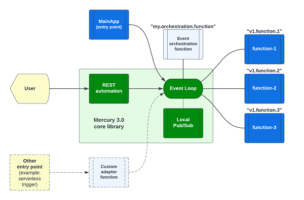

# Introduction

Mercury version 3 is a toolkit for writing composable applications.

At the platform level, composable architecture refers to loosely coupled platform services, utilities, and
business applications. With modular design, you can assemble platform components and applications to create
new use cases or to adjust for ever-changing business environment and requirements. Domain driven design (DDD),
Command Query Responsibility Segregation (CQRS) and Microservices patterns are the popular tools that architects
use to build composable architecture. You may deploy application in container, serverless or other means.

At the application level, a composable application means that an application is assembled from modular software
components or functions that are self-contained and pluggable. You can mix-n-match functions to form new applications.
You can retire outdated functions without adverse side effect to a production system. Multiple versions of a function
can exist, and you can decide how to route user requests to different versions of a function. Applications would be
easier to design, develop, maintain, deploy, and scale.

## Composable application architecture

> Figure 1 - Composable application architecture



As shown in Figure 1, a minimalist composable application consists of three user defined components:

1. Main modules that provides an entry point to your application
2. One or more business logic modules (shown as "function-1" to "function-3" in the diagram)
3. An event orchestration module to command the business logic modules to work together as an application

and a composable event engine that provides:

1. REST automation
2. An in-memory event system (aka "event loop")
3. Local pub/sub system

### Main module

Each application has an entry point. You may implement an entry point in a main application like this:

```javascript
async function main() {
    // ...
    // Load composable functions into memory
    ComposableLoader.initialize();
    // your main application code here
    // ...
}

main();
```

For a command line use case, your main application ("MainApp") module would get command line arguments and
send the request as an event to a business logic function for processing.

For a backend application, the MainApp is usually used to do some "initialization" or setup steps for your
services.

The "ComposableLoader.initialize()" statement will load your user functions into the event loop. There is
no need to directly import each module in your application. The "ComposableLoader" automates the loading.

Configure the functions you want loaded in the resources/preload.yaml, see the examples/resources/preload.yaml for an example.
In the future annotations may be available in node as they are like below and preload.yaml will not be necessary.

### Business logic modules

Your user function module may look like this:

```typescript
export class HelloWorldService implements Composable {

    name: string = "hello.world";

    @preload()
    initialize(): void {
        // no-op
    }

    getName(): string {
        return this.name;
    }
    
    async handleEvent(evt: EventEnvelope) {
        // your business logic here
        return someResult;
    }
}
```

Each function in a composable application should be implemented in the first principle of "input-process-output".
It should be stateless and self-contained. i.e. it has no direct dependencies with any other functions in the
composable application. Each function is addressable by a unique "route name" and you can use PoJo for input and output.

In the above example, the unique "route name" of the function is "hello.world".

> Writing code in the first principle of "input-process-output" promotes Test Driven Development (TDD) because
interface contact is clearly defined. Self-containment means code is more readable too.

### Event orchestration

A transaction can pass through one or more user functions. In this case, you can write a user function to receive
request from a user, make requests to some user functions, and consolidate the responses before responding to the
user.

Note that event orchestration is optional. In the most basic REST application, the REST automation system can send
the user request to a function directly. When the function finishes processing, its output will be routed as
a HTTP response to the user.

### The Composable engine

Event routing is done behind the curtain by the composable engine which consists of the REST automation service,
an in-memory event system ("event loop") and an optional localized pub/sub system.

### REST automation

REST automation creates REST endpoints by configuration rather than code. You can define a REST endpoint like this:

```yaml
  - service: "hello.world"
    methods: ['GET']
    url: "/api/hello/world"
    timeout: 10s
```

In this example, when a HTTP request is received at the URL path "/api/hello/world", the REST automation system
will convert the HTTP request into an event for onward delivery to the user defined function "hello.world". 
Your function will receive the HTTP request as input and return a result set that will be sent as a HTTP response
to the user.

For more sophisticated business logic, you can write a function to receive the HTTP request and do
"event orchestration". i.e. you can do data transformation and send "events" to other user functions to
process the request.

### In-memory event system

The composable engine encapsulates the standard Node.js EventEmitter library for event routing. It exposes the
"PostOffice" API for your orchestration function to send async or RPC events.

### Local pub/sub system

The in-memory event system is designed for point-to-point delivery. In some use cases, you may like to have
a broadcast channel so that more than one function can receive the same event. For example, sending notification
events to multiple functions. The optional local pub/sub system provides this multicast capability.

### Other user facing channels

While REST is the most popular user facing interface, there are other communication means such as event triggers
in a serverless environment. You can write a function to listen to these external event triggers and send the events
to your user defined functions. This custom "adapter" pattern is illustrated as the dotted line path in Figure 1.

## Test drive a sample application

To visualize what is a Composable application, let's try out the "Hello World" application in Chapter 2.

<br/>

|                   Home                    |                Chapter-2                |
|:-----------------------------------------:|:---------------------------------------:|
| [Table of Contents](TABLE-OF-CONTENTS.md) | [Hello World application](CHAPTER-2.md) |
